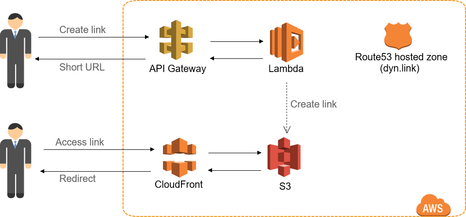

# dyn.link

AWS powered, serverless URL shortening service: http://dyn.link/

## Overview

The services used are API Gateway, Lambda, S3, CloudFront and Route53.

## TODO

* Improve the link generation. Fix CORS on API Gateway. Display the newly generated link in a HTML element without the need to leave the page.
* CloudFormation template to set up the necessary AWS resources
* ...

